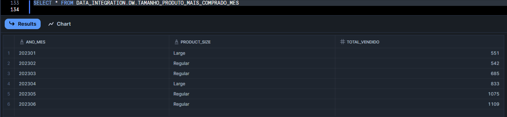
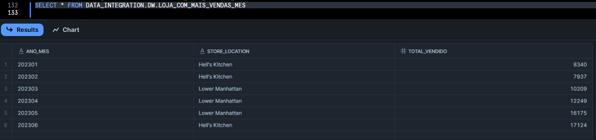
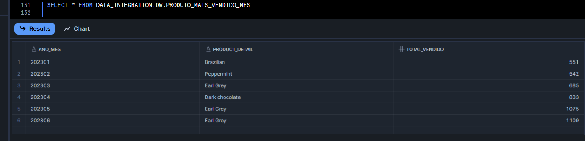
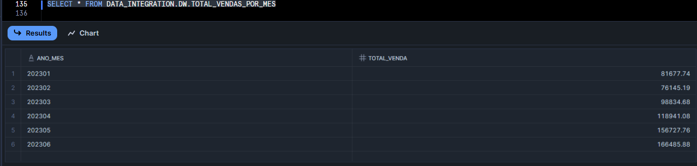
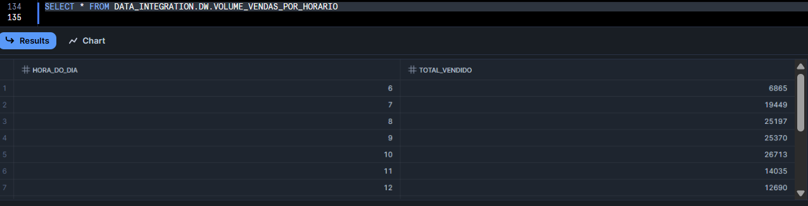

# ☕ Projeto Final - Integração de Dados: CoffeeShop DW com Airflow + Snowflake

Este projeto tem como objetivo criar uma estrutura de Data Warehouse (DW) para uma cafeteria fictícia, automatizando o processo de ingestão de dados usando Apache Airflow e armazenando os dados em Snowflake.

## 🔧 Requisitos

- Docker instalado
- Docker Compose instalado

## ▶️ Como executar

1. Clone o repositório e entre na pasta do projeto:
   ```bash
   git clone https://github.com/seu-usuario/coffeeshop-pipeline.git
   cd coffeeshop-pipeline
   ```

2. Execute o ambiente com Docker Compose:
   ```bash
   docker compose up
   ```

3. Acesse o Airflow:
   - URL: `http://localhost:8080`
   - Usuário: `airflow`
   - Senha: `airflow`

## ❄️ Acesso ao Snowflake

- Link: [https://app.snowflake.com/cymotiy/od77772/#/homepage](https://app.snowflake.com/cymotiy/od77772/#/homepage)
- Usuário: `ANDRERICARDO`
- Senha: `AndreProfessor123@`

---

## 📁 Estrutura de Pastas

```
DataIntegration_CoffeeShop/
│
├── dags/                      # DAGs do Airflow para ingestão e transformação
├── data/                      # Arquivos CSV utilizados como base
├── scripts/                   # Scripts SQL de criação de tabelas e queries
├── prints/                    # Prints das consultas realizadas no Snowflake
├── script/                    # Codigo em SQL das Analises realizadas
└── docker-compose.yml         # Definição do ambiente Docker
```

---

## 📊 Consultas realizadas

As seguintes perguntas foram respondidas com consultas SQL no Snowflake:

### 📸 1 - Quais os tamanhos mais comprados de produtos a cada mes


### 📸 2 -  Qual a loja que mais vende a cada mes


### 📸 3 -  Qual o produto mais vendido a cada  mes


### 📸 4 -  Qual o total de vendas por mes


### 5 - 📸 Qual o volume de vendas por horario


---

## 📝 Observações

- A dimensão `DIM_DATE` foi populada com as datas de 2023 utilizando Snowflake.
- Todas as transformações foram feitas dentro do Snowflake com Airflow orquestrando os processos.
- O projeto deve ser executado localmente com Docker.
- O acesso ao Snowflake foi compartilhado com o professor.

---

## 👨‍🏫 Avaliação

Este projeto foi realizado como parte da avaliação final na materia de Data Integration da pós-graduação em Engenharia de Dados.

## 🗯️ Integrantes

- Bruno Elly
- Bruno Pereira
- Daniel Lopes Braga Santos
- Gabriel Anchieta de Sales